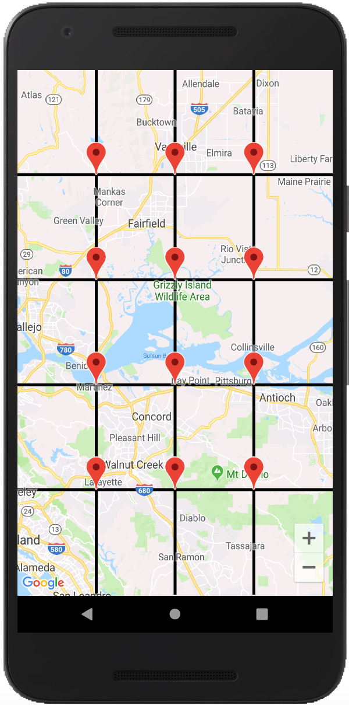

# myMap

- Develop a full screen Google Maps view, 
- Draw 3 vertical lines from top to bottom, which separates the map into 4 equal size areas.
- Draw 4 horizontal lines from left to right, which separates the map into 5 equal size areas.
- Put marker flags onto intersection points of those lines.

## Note:

  1. If you want to draw lines when camera is idle,
  
  
    + activate DrawLines() method in onCameraIdle() method, 
    - deactivate DrawLines() method  in the onCameraMove() method, 
    - deactivate DrawLines() in onMapReady() method.
  2. If you want to draw lines immediately after camera moves,
  
  
    + activate DrawLines() method in onCameraMove(), 
    + activate DrawLines() in onMapReady() method,
    - deactivate DrawLines() method  in the onCameraIdle() method.
  
  Default settings: activated DrawLines() method  in the onCameraIdle() method
### Screenshot:

  
